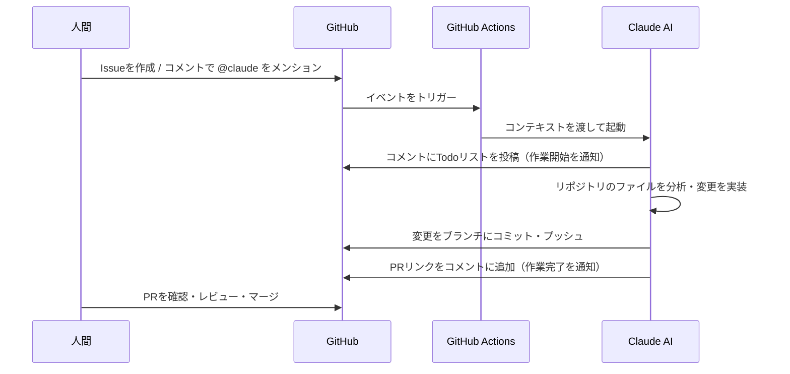

# サンプルドキュメント

Claude Issue Assistantの動作テスト用ドキュメントです。
このファイルへの変更依頼をIssueコメントで試してください。

## セクション一覧

現在のセクション:
- はじめに（このセクション）
- 機能一覧
- 動作フロー

Claudeへの依頼例:
- `@claude docs/sample.md に「## 機能一覧」セクションを追加してください`
- `@claude docs/sample.md の「はじめに」に説明文を3行追加してください`

## 機能一覧

- Issueコメントで `@claude` をメンションするとClaudeが自動対応
- ドキュメントの追加・編集リクエストに応答
- 変更内容をブランチにコミットしてPRを作成
- PRコメントでの追加指示にも対応

## 使い方

- このドキュメントはClaude Issue Assistantのテスト用です

## 動作フロー

人間が操作を行った際の、Claude Issue Assistantの動作フローを示します。

### 主なトリガーイベント

- **Issue作成時**: Issueの本文に `@claude` が含まれる場合
- **Issueコメント時**: コメント内で `@claude` をメンションした場合
- **PRコメント時**: PRのコメントで `@claude` をメンションした場合

## 活用例

このリポジトリで検証したClaude Issue Assistantの機能は、以下のような業務シーンで活用できます。

### ドキュメント管理の効率化

- 仕様書・手順書の追記・修正をIssueで依頼し、AIが自動でPRを作成
- レビュー担当者はコードではなくドキュメントの内容確認に集中できる
- `@claude README.md に○○の手順を追加してください` のような自然な指示で操作可能

### 開発フローへの組み込み

- IssueのラベルやテンプレートとAI対応を組み合わせたワークフローの構築
- ドキュメント更新漏れを防ぐため、機能実装Issueと連動してドキュメントPRを自動生成
- PRレビュープロセスにAIによる初期確認を追加し、人間のレビュー負荷を軽減

### チーム内ナレッジ共有

- 口頭で共有されがちな知識をIssueコメントで依頼・文書化
- 非エンジニアのメンバーもIssueコメントからドキュメント更新に参加しやすくなる
- 変更履歴がGitとPRで自動管理されるため、いつ・何を変更したか追跡が容易

## よくある質問

- **Q: このツールは誰でも使えますか？**
  A: はい、GitHubアカウントがあればどなたでもご利用いただけます。リポジトリにClaude Issue Assistantを設定するだけで使い始められます。

- **Q: 費用はかかりますか？**
  A: Claude APIの利用料金が発生します。GitHub Actionsの実行時間によってはその費用もかかる場合があります。詳細はAnthropicの料金ページをご確認ください。

- **Q: バグを見つけた場合はどうすればいいですか？**
  A: GitHubのIssueでバグを報告してください。再現手順や環境情報を添えていただくと、迅速に対応できます。
