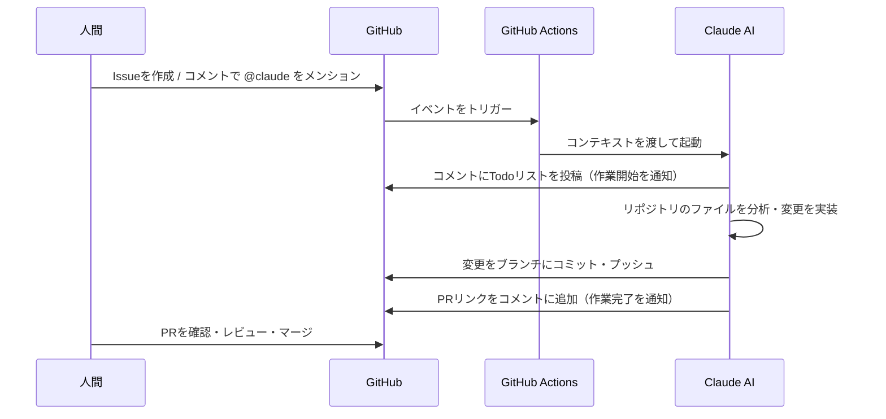

# サンプルドキュメント

Claude Issue Assistantの動作テスト用ドキュメントです。
このファイルへの変更依頼をIssueコメントで試してください。

## セクション一覧

現在のセクション:
- はじめに（このセクション）
- 機能一覧
- 動作フロー

Claudeへの依頼例:
- `@claude docs/sample.md に「## 機能一覧」セクションを追加してください`
- `@claude docs/sample.md の「はじめに」に説明文を3行追加してください`

## 機能一覧

- Issueコメントで `@claude` をメンションするとClaudeが自動対応
- ドキュメントの追加・編集リクエストに応答
- 変更内容をブランチにコミットしてPRを作成
- PRコメントでの追加指示にも対応

## 使い方

- このドキュメントはClaude Issue Assistantのテスト用です

## 動作フロー

人間が操作を行った際の、Claude Issue Assistantの動作フローを示します。

### 主なトリガーイベント

- **Issue作成時**: Issueの本文に `@claude` が含まれる場合
- **Issueコメント時**: コメント内で `@claude` をメンションした場合
- **PRコメント時**: PRのコメントで `@claude` をメンションした場合
